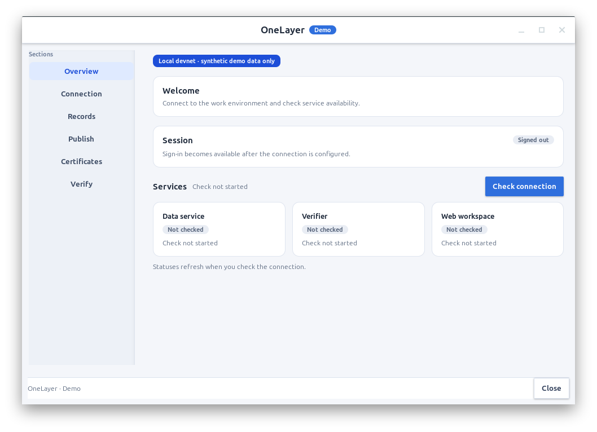

# Live-demo launcher — independent local checks, 2026-10-06

Branch: `feat/pipeline-live-demo-20261006`. Coordinator verification of MiMo V2.6 Pro/high implementation. Independent source review is still running; this evidence does not close full acceptance 02/10/11/19/20/21.

## Actual results

- `/usr/bin/python3 -m unittest discover -s apps/desktop/lab -p 'test_*.py'`: **286/286 PASS**, 115.882 seconds. GTK emitted model-disposal warnings during this full test run; they are not hidden as clean stderr.
- `./deploy/devnet-demo/live-demo status`: exit 0; real local demo-api and verifier responded healthy. Read-only devnet assessment reported missing operator key/role and unavailable legacy governance. Occupied ports make fresh-start preflight not ready; a running stack is reported separately.
- `./deploy/devnet-demo/live-demo start`: opened the actual GTK launcher on the target desktop, then exited 0 after the window closed. This command performed no chain setup/sign/send.
- `/usr/bin/python3 apps/desktop/lab/smoke.py --screenshot <temporary path>`: first run failed `REQUEST_INVALID` on the real installed signer. The test request had an epoch-day ledger value. Coordinator changed the fixture to valid `YYYYMMDD`, preserving signer validation. The repeated command **passed**: own-window render with no stderr, existing-prefix refusal, source root containing spaces, throwaway private operator key, real local signature over a synthetic transaction, real QR PNG decode, unavailable credential-service refusal without plaintext fallback, temporary-prefix cleanup. No chain writes or persistent demo keys were created.
- `bash -n deploy/devnet-demo/live-demo deploy/devnet-demo/native` and `git diff --check`: PASS.

## Boundaries and open work

The installed smoke uses an isolated HOME and synthetic signing request. It does not prove a finalized devnet publication. The current desktop API still consumes legacy `/v1` records/publication/certificate endpoints; the new durable `/v2/admin/workflow/publications` integration remains open. The legacy `gov.registry.land` namespace is unusable for governance setup because its authority key is lost. An explicitly selected ADR-0010 namespace must be separately reviewed/provisioned; no namespace was silently changed and no transaction approval was inferred.

This is a source-root-dependent GTK lab installation, not a signed bundled production release. Native SSO, hardware signer/custody, independent backup centers, signed updates, sustained soak and human production gates remain separate acceptance requirements.
