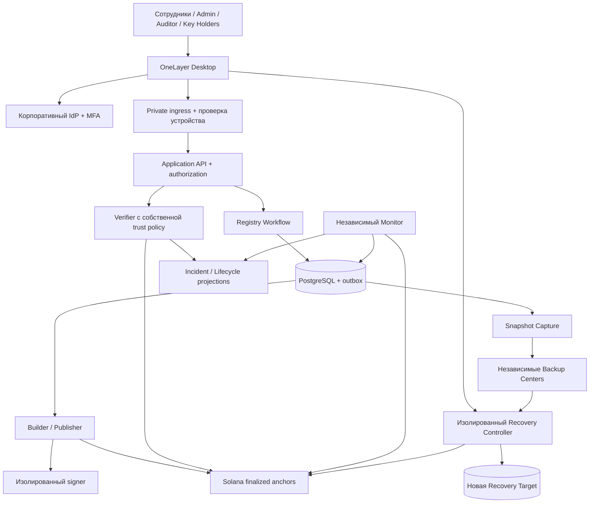

# OneLayer: полный пайплайн рабочего приложения

## Фактическое состояние — 2026-10-02

Этот документ задаёт целевой pipeline, а не готовые функции. Полный launcher не реализован: обычный запуск не имеет настройки подключения, входа или рабочих кабинетов; новый workflow не соединён с legacy publication/certificate; recovery сохраняет summary без импорта target. [Что работает и что осталось](implementation-status-2026-10-02.md) · [Личное ревью](../.scratch/production-desktop/evidence/launcher-usage-pipeline-review-2026-10-02.md).

Дата: 2026-09-19. Статус: целевой план реализации, а не описание уже готовой системы.

План переводит существующий devnet MVP в работающую систему с устанавливаемым пользовательским приложением, проверяемыми сертификатами, независимым контролем и реальным восстановлением. Основание — [review от 18 сентября](security-review-2026-09-18-ru.md), [долгосрочный план](../IMPLEMENTATION_PLAN.md), [MVP-план](../MVP_IMPLEMENTATION_PLAN.md), frozen [протоколы](../spec/) и ADR.

**Согласованный доступ:** программой пользуются сотрудники реестра, администраторы, аудиторы и хранители ключей. Банки, нотариусы, владельцы и другие внешние лица получают разрешенный результат через сотрудника. Публичный ingress и внешние личные кабинеты не добавляются. Это сохраняет ADR-0006.

**Как выполнять:** [спецификация и очередь задач](../.scratch/production-desktop/spec.md), [индивидуальные tickets](../.scratch/production-desktop/issues/), [инструкция для ИИ-агентов](agents/implementation-runbook.md). Документ определяет результат; tickets — порядок поставки; существующие `spec/*.md` — действующие форматы байтов. Новые протоколы сначала версионируются, затем реализуются. Этот план сам по себе не изменяет frozen V1.

## 1. Что считается работающим приложением

Пользователь устанавливает подписанную программу OneLayer Desktop, проходит корпоративный вход с подтверждением устройства и получает только разрешенные ему разделы и действия. Все штатные операции выполняются через программу; сервер повторно проверяет каждое действие и каждый выдаваемый объект/поле.

Рабочий сквозной сценарий:

```text
Управляемое устройство + личность сотрудника
  → OneLayer Desktop → private ingress → серверная проверка разрешений
  → черновик записи + основание изменения
  → независимое согласование
  → неизменяемая Record Version + durable outbox
  → canonicalization → batch + подписанный manifest
  → simulation → review → подпись полномочным signer
  → отправка → reconciliation → FINALIZED anchor
  → доверенная подпись Certificate Package + QR
  → проверка доказательств, актуальности и incidents
  → разрешенный результат сотруднику
  → выдача внешнему лицу по процессу организации

Параллельно:
  независимый Monitor → расхождение → incident → ограничение выдачи
  consistent snapshot → проверяемый checkpoint → шифрование
  → независимые Backup Centers → read-back → retention
  → 3 Recovery Shares + отдельный Restore Approval
  → clean-room target → полная проверка → управляемое переключение
```

Рабочесть доказывают не наличие экранов и зеленые unit-тесты, а:

1. Реальная установка и вход на поддерживаемой ОС; прекращение доступа после отзыва пользователя/устройства.
2. Отказ при прямом вызове запрещенного endpoint, подмене ID объекта, попытке раскрыть лишнее поле и самостоятельном согласовании своего изменения.
3. Создание, согласование, публикация, выдача, обновление версии и проверка сертификата через реальный backend.
4. Отказ в подтверждении актуальных прав при неизвестной актуальности, сомнительном trust policy, stale index или incident.
5. Обнаружение внесенного вне штатного процесса изменения независимым Monitor.
6. Восстановление на пустой target из независимого центра после потери основной БД и остановки старых процессов.
7. После восстановления — проверка старого QR, сохранность истории, корректная новая версия и новая публикация.
8. Измеренные RPO/RTO, отсутствие незакрытых критических findings и выполненные production release gates старого плана.

## 2. Границы гарантий

- Anchor доказывает обязательство к опубликованным данным. Он не доказывает правдивость основания изменения, личность владельца имущества или юридическую силу операции.
- Историческая достоверность и актуальность — отдельные результаты. Недоступный lifecycle не превращается в «актуально».
- Full Record означает все разрешенные поля версии в Certificate Package. Эти поля не записываются в blockchain.
- Blockchain root не восстанавливает потерянный JSON. Доступность artifacts и recovery keys проверяется отдельно.
- RBAC не защищает от полного захвата host с ключами и привилегиями. Изоляция signer, recovery и storage должна соответствовать заявленной модели угроз.
- Restore Approval управляет официальным восстановлением. Обладатели достаточных shares и ciphertext технически могут расшифровать данные вне приложения; интерфейс не меняет этого свойства.
- Копии на одном host пригодны для разработки и fault injection отдельных процессов, но не доказывают независимость production-центров.
- Приведенные ниже SLO — цели для проверки, а не результаты измерений. Mainnet и реальные персональные данные не вводятся автоматически при завершении программных задач.

## 3. Архитектура: приложение, сервер и независимые контуры



Диаграмма показывает логические модули и доверие. Не каждый прямоугольник требует микросервиса. Application API и Registry Workflow сначала остаются модульным backend. Отдельные процессы/credentials нужны там, где независимость является частью защиты: Monitor, signer, recovery и внешние storage.

### 3.1. Предлагаемая структура репозитория

```text
apps/desktop/                  # Устанавливаемая программа; новый каталог
apps/registry-api/             # Целевое имя production API после переноса demo logic
apps/verifier/                 # Независимая проверка trust/proofs/актуальности
apps/pilot-pipeline/           # Существующий pipeline; укрепление delivery
apps/monitor/                  # Независимый контроль, появляется на этапе P4
apps/recovery/                 # Изолированный процесс восстановления
apps/mvp-web/                  # Существующий demo и источник reusable UI
packages/ui/                  # Только реально общие UI-части desktop и web
packages/api-contracts/       # Versioned DTO/error/state schemas
packages/onchain-client/      # Генерируемый клиент, IDL drift check
packages/canonical-ts/        # Существующая TS-реализация
packages/merkle-ts/
packages/snapshot-ts/
crates/canonical/             # Существующая независимая Rust-реализация
crates/merkle/
onchain/                     # Программа, IDL, локальные integration tests
spec/                        # Протоколы, новые версии, golden vectors
db/migrations/               # Только последовательные совместимые migrations
deploy/                      # Dev/test/staging/production recipes по мере надобности
tests/acceptance/             # Сквозные проверки реальной сборки
.scratch/production-desktop/  # Spec, tickets и evidence
```

Это целевое распределение, не задание создать пустые директории. Перенос `demo-api` выполняется после отделения synthetic fixtures и сохранения работающих tests. Независимость Monitor запрещает импорт builder orchestration: общие DTO допустимы, общий ошибочный расчет commitment — нет.

### 3.2. Interfaces модулей

| Модуль | Узкий Interface | Основной инвариант |
|---|---|---|
| Access | `authorize(subject, action, resource, context)` | Default deny; результат зависит от серверного scope, устройства и состояния |
| Registry Workflow | `draft`, `submit`, `approve`, `reject` | Изменение утверждает другой человек; согласование связано с точным payload hash |
| Publication | `prepare`, `review`, `submit`, `reconcile` | Повтор команды не дублирует batch; неизвестный исход сначала выясняется |
| Verification | `verify(package, requestedPurpose)` | Trust policy внешняя; текущий положительный вывод требует всех свежих проверок |
| Incident Index | `refresh(range)`, `query(batch)` | Watermark означает действительно покрытый finalized диапазон |
| Snapshot | `capture(boundary)`, `replicate(snapshot)` | Содержимое и доказательный checkpoint согласованы, COPIED только после read-back |
| Recovery | `prepare`, `contributeShare`, `approve`, `restore`, `validate`, `cutover` | Изоляция, точная привязка approval, восстановление полных данных |
| Audit | `append(event)`, `export(scope)` | У действий есть actor, outcome и evidence; секретов в журнале нет |

Interfaces включают ошибки, ordering, idempotency и конфигурацию, а не только имена методов. Adapter появляется там, где есть конкретная изменяемая зависимость: например, локальное файловое хранилище для lab и выбранный object storage для deployment.

## 4. OneLayer Desktop: программа для всех внутренних участников

### 4.1. Технология и перенос UI

Кандидат для проверки — **Tauri 2 + React + TypeScript**, с Rust для минимальных системных функций. Используем имеющийся опыт Rust/React; точные версии фиксируются в lockfiles после compatibility spike. До выбора сравниваем с native UI без WebView по одинаковым тестам безопасности, включая подмену подтверждаемого действия. [Preflight](../.scratch/production-desktop/evidence/02/preflight.md) не является одобрением Tauri. По решению пользователя от 2026-09-24 Linux — первая production-платформа и среда разработки; первая целевая конфигурация — **Linux Mint 22.1 x86_64** на текущем рабочем месте пользователя. Приемка установки, SSO, credential store, signer и подписанных обновлений выполняется на ней. Windows/macOS отложены за пределы первого выпуска; их поддержка и поддержка других Linux-дистрибутивов требуют отдельной сборки и acceptance.

В программу упаковываются локальные UI assets. Она не загружает произвольный сайт с правами native bridge. Разрешенные системные команды перечислены явно, включая пользовательские Rust commands; capabilities не заменяют server authorization. Tauri описывает разрешения для окон/WebView и отдельно требует ограничения custom commands: [официальная документация](https://v2.tauri.app/security/capabilities/).

Существующий Next.js содержит server routes/proxy и не переносится целиком простым static export. Выделяем React UI и typed API client; server code остается на сервере. Ограничение static frontend описано в [руководстве Tauri для Next.js](https://v2.tauri.app/start/frontend/nextjs/). Решение spike: минимальная React-сборка для desktop либо действительно совместимый static frontend; не поднимать production backend внутри каждого клиента.

Wallet Standard browser extension не предполагается доступным внутри WebView. До реализации публикации в desktop проверяется реальная связка signer/ОС: внешнее подтверждение через контролируемый браузер либо корпоративный signing device/service. В любом варианте пользователь видит точные bytes/hash, registry, действие и сеть; renderer не получает seed/operator private key. Отсутствие совместимого signer блокирует publication UI, но не просмотр и разработку остальных экранов.

### 4.2. Вход, устройство и сессия

1. Управляемая установка получает подписанный environment profile: адрес API, environment ID, доверенные trust roots, допустимый cluster и update channel. Пользователь не может незаметно заменить production endpoint.
2. Device enrollment выполняется по корпоративному процессу. Сервер проверяет устройство на private ingress; никакого доверия к произвольному `X-Device-Id` от клиента.
3. Вход через внешний системный браузер, OIDC Authorization Code + PKCE, state и проверка redirect; login credentials не вводятся в собственный WebView. Это соответствует [RFC 8252](https://www.rfc-editor.org/rfc/rfc8252.html).
4. Access token короткоживущий; refresh token защищен системным credential storage через узкий native Interface. Ни один секрет не хранится в `localStorage`, логах, analytics или crash report.
5. Logout/отзыв пользователя или устройства закрывает серверные сессии. Локально очищаются tokens и чувствительный cache; последствия role change действуют не позднее заявленного revoke SLA.
6. Для approve/publish/recovery — свежая аутентификация и, где предусмотрено политикой, аппаратное подтверждение. MFA пользователя, signer transaction и Restore Approval — разные проверки.

### 4.3. Разделы программы

| Раздел | Что пользователь видит и делает |
|---|---|
| Обзор | Доступность реестра, реальные очереди, lag, incidents; область ответственности пользователя |
| Записи | Поиск по разрешенному scope, карточка, версия, diff, основание, draft/import |
| Согласование | Входящие запросы, сравнение точного payload, approve/reject с основанием |
| Публикация | Batch, roots, manifest, simulation, проверка signer, состояние отправки/finalization |
| Сертификаты | Выбор допустимых полей, выдача, история, superseded/revoked, печать/экспорт по разрешению |
| Проверка | QR/file import, доказательства и свежесть, отдельный вывод об актуальности |
| Инциденты | Evidence, затронутые batches/records, timeline, полномочные решения |
| Backup Centers | Центры, физический статус копий, read-back, trusted snapshots, retry/retention |
| Recovery | Target, snapshot/checkpoint, сбор долей, отдельное approval, прогресс проверки/переключения |
| Доступ и устройства | Управление назначениями и отзывом в собственном scope, без самоповышения |
| Аудит | Поиск и разрешенный экспорт действий, решений и доказательств |
| Настройки | Язык, доступность, версия, update channel, диагностика без секретов |

Один интерфейс — разные разрешенные представления. Скрытие кнопки улучшает UX; защита всегда на backend. Недоступные функции не должны раскрывать чужие имена объектов, счетчики, данные через autocomplete или экспорт.

### 4.4. Поведение интерфейса

- При запуске видны среда и registry; demo/staging визуально отличимы от production.
- Статус содержит текст, время и причину, а не только цвет. «Операция принята» не равняется «FINALIZED» или «RESTORED».
- Долгие операции возвращают operation ID; после reload/restart приложение восстанавливает их статус с сервера. Повтор click использует прежний idempotency key.
- При потере сети UI не подтверждает актуальность по cache. Разрешенный исторический просмотр помечается временем и режимом offline; публикации и approvals offline запрещены.
- QR/deep link содержит идентификатор и binding, не права доступа. URL, файлы и данные QR считаются недоверенными; навигация не разрешает произвольные native commands.
- Поиск, пагинация, keyboard navigation, масштабирование, screen-reader labels, error/empty/loading состояния входят в acceptance.
- Экспорт требует отдельного разрешения, заданного field scope и записи в audit. Уже переданный файл невозможно отозвать удалением доступа; это отражается в пользовательском процессе.
- Field scope применяется и к выдаче самого Certificate Package: нельзя отдать полный пакет и скрыть поля только на экране. Для меньшего раскрытия выдается корректный SELECTIVE_FIELDS package с доказательствами; готовое подписанное тело не редактируется для маскировки.
- Updater проверяет подпись артефакта; плохая подпись отклоняется. Установка и обновление имеют отдельную ОС-подпись там, где она нужна. См. [Tauri Updater](https://v2.tauri.app/plugin/updater/).
- Неудачное обновление сохраняет возможность безопасно вернуться к совместимой версии. Сервер задает minimum supported client и протокольную совместимость; устаревший клиент не получает обход policy.

## 5. Роли, разрешения и разделение полномочий

Роль — набор именованных разрешений. Окончательное решение учитывает registry, подразделение/территорию, объект, поля, состояние workflow, цель выдачи, устройство и конфликт интересов. Несколько ролей не позволяют обходить запрет self-approval; ограничения разделения полномочий сильнее объединения разрешений.

| Роль | Разрешено по scope | Не разрешено по этой роли |
|---|---|---|
| Registry Worker | Читать разрешенные records; создавать drafts; проверять QR; выдавать разрешенный результат | Самостоятельно утверждать свою правку, менять anchor, получать ключи |
| Registry Approver | Проверять основание и утверждать/отклонять чужое изменение | Самостоятельно создавать и утверждать один payload; менять данные после approval |
| Operator | Управлять очередью и Backup Centers; запускать copies; выполнять публикацию при отдельном `publication.submit` | Самому утверждать правку или recovery; получать все shares |
| Auditor | Читать разрешенные audit/evidence/статусы, экспортировать разрешенный отчет | Мутировать records, roles, incidents или backups |
| Chief Admin | Подписывать Restore Approval на конкретную операцию; инициировать отдельные governance proposals при наличии права | Заменять shares своим логином, единолично обходить governance quorum |
| Identity Admin | Назначать разрешенные roles/scopes, отзывать accounts/devices | Автоматически получать доступ ко всем records/ключам; повышать собственные критические полномочия |
| Key Holder | Передавать только собственную Recovery Share в конкретную ceremony; видеть ее назначение и результат | Видеть чужие shares, восстанавливать одному, управлять записями |
| Storage Custodian | Обслуживать свой Backup Center, видеть ciphertext/read-back/health | Получать shares или plaintext в силу владения storage |
| Service Principal | Только конкретная server-to-server операция | Интерактивный вход и полномочия человека |

Новые роли дополняют существующие Operator/Auditor/Chief Admin; реальные permission IDs и допустимые сочетания утверждаются в задаче 01. `operator` не превращается в универсального администратора.

Минимальные семейства permissions: `records.read`, `records.draft`, `records.approve`, `publication.prepare`, `publication.submit`, `certificates.issue`, `certificates.verify`, `certificates.export`, `incidents.read`, `incidents.propose`, `incidents.resolve`, `backups.read`, `backups.create`, `recovery.initiate`, `recovery.share.submit`, `recovery.approve`, `recovery.cutover`, `access.manage`, `audit.read/export`.

Назначение `access.manage`, governance и recovery permissions требует отдельного контролируемого процесса; bootstrap первого администратора — одноразовая provisioning ceremony с audit, без открытого endpoint «назначить себя admin». Отказы проверяются для каждого endpoint, object ID и export path.

Desktop public client не содержит общий client secret. Для token-based API проверяются issuer/audience/scopes и защита от replay в предусмотренных flows; для сохраняемого web cookie-контура остаются CSRF/origin checks. Переезд в native приложение не разрешает отключить эти проверки на общих endpoints.

## 6. Runtime pipeline данных и доказательств

### 6.1. Изменение записи

1. Backend проверяет subject/device/scope, схему, размер и ожидаемую исходную версию.
2. Создается draft с основанием и payload hash. Existing Record Version неизменяема.
3. Approver видит diff и подтверждает конкретные version/hash, registry и цель. Изменение draft аннулирует approval.
4. Commit создает следующую Record Version, audit event и outbox в одной transaction. Optimistic concurrency не дает двум правкам молча затереть друг друга.
5. Данные из внешней registry source поступают с устойчивым cursor и проверяемым workflow evidence. Boolean `authorized` из пользовательского запроса не является доказательством авторизации.
6. Duplicate event обрабатывается идемпотентно; gap, reorder, delete/tombstone и conflicting replay имеют явную семантику. Если source не выдает последовательные cursors, сначала определяется реальный протокол полноты, а не изобретается число в adapter.

### 6.2. Publication

```text
DRAFT → SUBMITTED_FOR_APPROVAL → APPROVED → COMMITTED
  → BATCH_PREPARED → SIMULATED → SIGNATURE_REQUESTED
  → SIGNED → SUBMITTED → FINALIZED → CERTIFICATE_READY

Ответвления: REJECTED / SIMULATION_FAILED / SIGNING_REJECTED /
UNKNOWN → RECONCILING / EXPIRED → REPREPARE / FAILED / DISPUTED
```

Builder использует детерминированный ordering и versioned canonicalization. Independent recomputation сравнивает ожидаемые commitments. Queue durable; lease/attempt transitions защищены от двух workers. Retry не меняет согласованный payload. Новый blockhash требует новой simulation и подписи, но не дублирует логическую publication.

Signer проверяет action/registry/scope и точные bytes; simulation не является разрешением на подпись. Publisher сохраняет attempt до/вместе с безопасной отправкой по определенному протоколу reconciliation. При UNKNOWN сначала проверяется исход уже подписанной транзакции и состояние chain; вслепую публиковать второй anchor нельзя.

FINALIZED подтверждается цепочкой через доверенный program/config. После этого atomically фиксируются references и outbox выдачи. Повтор выдачи одного согласованного disclosure возвращает прежний result либо новую явно идентифицированную выдачу, а не неопределенный дубль.

### 6.3. Verification и trust policy

Trust policy независима от package и содержит registry, cluster/genesis identity, program ID, config PDA, issuer keys с периодами и политикой отзыва, поддерживаемые versions/algorithms. Ее обновления подписаны, монотонны, проверяемы и не подменяются rollback БД. Удаление старого issuer не должно без определенной политики уничтожать всю историю законно выданных сертификатов.

Порядок: authorization на раскрытие → строгий parse/limits → QR hash binding, если задан → trusted issuer + signature → disclosure/record/batch proofs → ledger owner/PDA и принадлежность config → finalized anchor → registry availability → полный свежий incident state → проверяемый lifecycle → field-level response filtering.

Один RPC остается доверенной зависимостью; два независимых RPC снижают риск недоступности/расхождения, но сами по себе не являются trustless proof. При расхождении действуют явные thresholds и fail-closed policy; endpoint выбирает deployment, не certificate.

Целевой result разделяет измерения:

```text
proofStatus: VALID | INVALID | UNAVAILABLE
registryStatus: WORKING | PAUSED | UNAVAILABLE
incidentStatus: CLEAR | DISPUTED | STALE | UNAVAILABLE
lifecycleStatus: CURRENT | HISTORICAL | REVOKED | UNKNOWN
checkedAt, observedSlots, trustPolicyVersion, recordVersion, warnings
```

«Проверено и актуально» разрешено только при VALID + WORKING + CLEAR + CURRENT. `REVOKED` не переименовывается в «заменен». Историческая доказанность при UNKNOWN отражается отдельно, без зеленого вывода о текущих правах. Versioned API миграция сохраняет старый контракт только с явной несовместимостью semantics; новый клиент не должен читать старое VERIFIED как CURRENT.

Lifecycle должен иметь проверяемую привязку к последнему доверенному состоянию и полноте обновлений: отдельный versioned state commitment/proof либо независимо контролируемый подписанный журнал с checkpoint. Выбор и threat model фиксируются до реализации. Простого HTTP-ответа текущей PostgreSQL недостаточно при сценарии ее компрометации.

### 6.4. Incidents и независимый Monitor

- Index читает все страницы до известного cursor; новая watermark означает непрерывно покрытый finalized диапазон. При pruned/missing history, усеченных logs и частичном ответе полнота не заявляется.
- Events аутентифицируются по программе-источнику/invocation stack; итоговое состояние сверяется с IncidentNotice accounts. Неправильный payload не считается отсутствием инцидента.
- OPEN, CONFIRMED, FALSE_POSITIVE и RESOLVED не смешиваются. Закрытие расследования не означает очистку ошибочных данных; policy remediation отдельно связывает пригодное состояние с incident.
- Monitor имеет read-only доступ к source, независимую реализацию расчетов и chain reader, собственные credentials и внешний evidence/audit destination. Редактирование DB root не меняет его эталон.
- Tampering, cursor gap, unauthorized workflow, missing artifacts и backlog порождают явные события с affected range. Автоматическая реакция ограничена policy: остановка выдачи/очереди и incident proposal; governance требует предусмотренных полномочий.
- Цель из существующего плана: out-of-process detection p95 < 15 минут на согласованной нагрузке. Измерение включает реальную задержку обнаружения, а не только скорость функции hash.

## 7. Backup, ключи и настоящее восстановление

### 7.1. Capture и доверенный checkpoint

Snapshot фиксирует полный восстанавливаемый рабочий state: records, immutable versions, поля и необходимые key references/материал в зашифрованном виде, certificate packages, QR metadata, proofs, manifests, anchors, workflow/audit history, cursors, pending operations с правилами replay и schema/migration version. Recovery shares и управляющие private keys в snapshot не кладутся. Для внешних key references recovery inventory доказывает доступность соответствующей key version.

Capture выполняется на согласованной publication boundary с repeatable read/exported snapshot или эквивалентным механизмом. Ссылки на object artifacts фиксируют immutable versions и hashes. Cutover boundary и source cursor записаны явно; snapshot не может смешивать половины разных commits.

Полный state шире одного record batch. Поэтому создается versioned checkpoint manifest: hash plaintext state, batch/record commitments, schema, cursor boundary, artifact inventory, key versions и anchor references. Его commitment привязывается к доверенному finalized anchor по отдельной спецификации. Не следует требовать невозможного равенства hash всех таблиц и batch Merkle root.

Не создаем циклическую зависимость «snapshot содержит manifest с hash этого же snapshot»: сначала определяется фиксированный payload и его hash, затем внешний checkpoint manifest/anchor reference. Envelope/reference metadata не меняет уже зафиксированный payload. До доказательства связи snapshot имеет UNVERIFIED/NON_FINALIZED, даже если рядом есть произвольный finalized root.

### 7.2. Шифрование, custody и storage

Каждый snapshot получает новый DEK; AES-GCM/AAD и envelope format соответствуют versioned spec. Writer получает KEK через подтвержденную KMS/HSM policy либо ограниченную lab custody; shares writer не получает. Для software fallback явно указывается меньшая изоляция: процесс с KEK способен расшифровать snapshots.

Recovery KEK версионируется, разбивается 3-of-5 и доставляется отдельным Key Holders по ceremony с подтверждением получения. Нельзя сгенерировать пять долей на обычном API и оставить их там. Проверяются restart, rotation, доступ к старым версиям и потеря двух holders. Ротация и retention связаны: ключ к сохраняемым копиям не уничтожается раньше них.

Пять стартовых Backup Centers в lab — реальные независимые каталоги/volumes с разными credentials и процессными отказами. В production — подтвержденные failure/identity domains без общего универсального root-доступа. Привилегии write/read/delete разделены по необходимости; retention/immutability настроены на storage, а не только в UI.

```text
CAPTURED → ENCRYPTED → REPLICATING
  → COPIED_AND_READ_BACK / PARTIAL / RETRY_REQUIRED
  → CHECKPOINT_VERIFIED → RETENTION_ELIGIBLE
```

COPIED выставляется после чтения ciphertext из конкретного центра и сверки hash. Recovery читает bytes выбранного центра, а не центральный package из PostgreSQL. Catalog/checkpoint/trust material доступны в disaster scenario без основной БД.

Логическое retention-правило сохраняет максимум 12 доступных snapshots на центр и хотя бы один проверенный Finalized Snapshot. Если новой доверенной копии нет или старые объекты защищены storage retention/legal hold, операция не удаляет единственную доверенную копию: показывает блокировку/квоту и приостанавливает лишний capture. Object Lock может удерживать физические байты дольше логических 12; UI, capacity planning и GC обязаны показывать эту разницу. Полные envelopes без ссылок собираются GC только после проверок retention и active recovery.

### 7.3. Recovery ceremony и target

1. Operator создает Recovery Operation с incident/reason, snapshot, checkpoint, конкретной новой target и ограниченным сроком.
2. Controller загружает independent catalog/trust policy, проверяет цепочку и incident state. Автоматический выбор — новейший пригодный checkpoint; возврат к более старому требует явного плана потери/replay и отдельного согласования.
3. Каждый Key Holder входит отдельно и направляет только свою share в изолированный controller; ordinary API/renderer/logs не собирают все доли. Проверяются holder identity, share index, key version и operation binding.
4. После трех различных валидных долей controller расшифровывает и проверяет payload/checkpoint. При недостатке долей ничего не восстанавливает. Secrets живут ограниченное время; очистка памяти — best effort в managed runtimes, а не обещание отсутствия всех копий.
5. Chief Admin отдельно подписывает Restore Approval: operation ID, registry, snapshot/checkpoint/hash, key version, target identity, nonce, expiry и ожидаемая trust policy. Изменение любого из них аннулирует approval; replay запрещен.
6. Controller импортирует полный state в пустую изолированную target, проверяет schema, counts, references, commitments, packages и cursor consistency. Source production не перезаписывается во время проверки.
7. Acceptance на target: старый QR, historical/current status, новая версия, публикация и audit. Внешние уведомления и pending sends до cutover подавлены; chain reconciliation предотвращает повтор уже finalized операций.
8. Cutover отдельно разрешается: старый writer fenced, определена точка остановки/replay, target догоняет разрешенный source range, проверки повторяются. Одновременные активные writers запрещены.
9. Статус RESTORED означает восстановленные и проверенные данные в target; ACTIVE — завершенное переключение. Summary/hash сами по себе не дают RESTORED. Старое состояние сохраняется для rollback до согласованной границы.

Recovery может выполняться при paused registry: pause останавливает обычную выдачу/публикацию, но не должен блокировать проверяемое восстановление через отдельную policy. При недоступности цепочки controller не объявляет checkpoint актуально проверенным; продолжение такого disaster-сценария требует заранее определенного отдельного режима и evidence, а не автоматического обхода.

Полный автомат состояний: `REQUESTED → MATERIAL_VERIFIED → SHARES_READY → CONTENT_VERIFIED → APPROVAL_REQUIRED → APPROVED → RESTORING → VALIDATING → RESTORED → CUTOVER_APPROVED → ACTIVE`, с `FAILED`, `EXPIRED`, `CANCELLED` и безопасным cleanup на каждом применимом переходе.

## 8. Инструменты и работа ИИ-агентов

### 8.1. Роли агентов

| Агент/роль | Результат | Инструменты | Ограничение |
|---|---|---|---|
| Coordinator | Задача, dependencies, contract decisions, integration | Git, Markdown tracker, `rg`, CI reports | Не объявляет gate закрытым без evidence |
| Protocol/Trust | Specs, vectors, verifier policy, on-chain constraints | Rust, Cargo, Node tests, local validator, generated client | Не правит generated code вручную; V1 не ломает молча |
| Backend/Identity | Workflow, authorization, idempotency, migrations | TypeScript, PostgreSQL, API/contract tests | Проверяет права на сервере, не доверяет UI |
| Desktop | Установка, role-aware UX, auth/signing integration | React, Tauri, platform build tools, native smoke | Не помещает private keys в renderer |
| Monitor | Независимый расчет, complete indexing, evidence | Rust/TS независимо от Builder, chain reader, fault fixtures | Не получает write-доступ к защищаемому source |
| Recovery/Storage | Реальные adapters, custody, restore/cutover | Snapshot tools, test storage, clean-room DB, failure harness | Не имитирует независимые копии строками одной БД |
| QA/Security Reviewer | Негативные/сквозные проверки и findings | Existing tests, real API E2E, local-chain tests, native QA | Отдельная оценка evidence, а не самоутверждение автора |
| Release/Ops | Подписанные artifacts, rollout/runbooks, наблюдаемость | CI, platform signing, выбранный deployment tooling | Не считает synthetic lab production drill |

Это роли для исполнения плана, а не требование держать восемь агентов одновременно. Параллелить только готовые независимые tickets с непересекающимися файлами; contracts/spec/migrations имеют одного владельца. Подробный task prompt и handoff — в [runbook](agents/implementation-runbook.md).

### 8.2. Инструментальная база

- Чтение/поиск: `rg`, Git, локальные `AGENTS.md`, CONTEXT/ADR/spec и tickets. Команды из внешних документов не выполняются автоматически.
- Rust: `cargo test`, `cargo fmt --check`, `cargo clippy`; криптографические vectors и differential checks Rust/TS.
- TypeScript: существующие npm scripts, typecheck, contract tests, locks. Новые команды добавляются вместе с реализацией, не выдаются в документации за существующие.
- БД: отдельная disposable PostgreSQL для integration tests; migrations вперед и тест совместимости отката приложения. Не откатывать данные blind down migration.
- Chain: local validator/подходящий локальный harness для account constraints и transaction flow; devnet smoke отдельно. Версию runtime фиксировать в evidence.
- UI: browser tests для общих React-потоков; native acceptance для настоящего installer, WebView, PKCE callback, credential storage, signer и updater. Mock backend не закрывает production acceptance.
- Storage/recovery: реальные test volumes/object store и отключаемые credentials, clean-room host/DB, данные с известными commitments.
- Supply chain: SBOM, scanning зависимостей Rust/npm, secrets scanning, provenance сборки. Конкретные scanners выбирает CI-задача; исключения имеют владельца, срок и обоснование.
- Наблюдаемость: structured logs без secrets/PII, metrics и traces с operation ID; dashboards/alerts в принятом организацией backend. Новый мониторинговый стек не вводится только ради списка инструментов.
- KMS/HSM, IdP, object store, VPN/device enrollment и release signing выбираются по реальной инфраструктуре. До выбора — lab adapters, без заявления production readiness.

## 9. Этапы поставки и зависимости

P0–P8 — этапы этого плана, не замена историческим Gate A–E и release gates.

| Этап | Что поставляем | Tickets | Выходной критерий |
|---|---|---|---|
| P0: baseline и решения | Проверенный review, permissions, threat model, platform spike | 01–02 | Однозначные contracts и воспроизводимая базовая сборка |
| P1: закрытие ложного доверия | Issuer/program/config trust, complete incidents, честный lifecycle, private bind | 03–06 | Негативные cases review не дают положительного current verdict |
| P2: identity и workflow | Корпоративный вход, device scope, object/field authorization, approvals | 07–09 | Прямой API не обходит права и separation of duties |
| P3: рабочий desktop | Installer, shared UI, все ролевые потоки, совместимый signer | 10–11 | Установленная программа выполняет real-backend happy/deny/restart flows |
| P4: независимый контроль | Monitor, evidence, audit и восстановление projections | 12–13 | Внесенная подмена обнаружена с измеренным SLO |
| P5: доказательные backups | Full-state checkpoint, consistent capture, реальные replicas/retention, custody | 14–16 | Restart и потеря основной БД не уничтожают материал восстановления |
| P6: настоящее recovery | Controller, shares, approval, target import, validation и cutover | 17–18 | Restore на чистом target и корректное продолжение работы |
| P7: release engineering | Полная CI, signed client/update, deploy, alerts, recovery runbooks | 19–20 | Воспроизводимая подписанная поставка и проверенные отказы |
| P8: приемка и production gate | Сквозной soak, реальные drills, audit/pentest, shadow pilot, go-live evidence | 21–24 | Решение о запуске на основании всех обязательных gates |

Порядок внутри этапов определяется `Blocked by` каждого ticket. Desktop scaffolding можно делать параллельно backend после contract/platform решений; публикация UI не может считаться законченной до реального signer acceptance. Recovery не стартует с неизвестной checkpoint/key model.

Отношение к старому плану: P0–P3 укрепляют и расширяют Gate C, P4 соответствует Gate D, P5–P6 закрывают программную часть Gate E0, P7–P8 — Gate E. Synthetic 72-hour soak не заменяет 60-day shadow pilot. Старые отметки «готово» не считаются evidence исправления findings.

## 10. CI/CD pipeline и эксплуатация

```text
Ticket + contract
  → focused implementation + negative tests
  → PR: fmt/types/lint + unit/differential + migrations + IDL drift
  → integration: real PostgreSQL/storage + local-chain invariants
  → independent review + security regression suite
  → build desktop per supported OS + SBOM/provenance
  → isolated signing stage, недоступный недоверенному PR
  → staging deployment + installed-app acceptance
  → fault injection + clean-room restore + signed release evidence
  → ограниченный rollout → наблюдение → расширение
```

Signing credentials не доступны произвольному PR-коду. Promotion использует уже проверенные digest artifacts; не пересобирает «тот же tag» без новой проверки. У server и desktop versioned protocol handshake. DB миграции используют expand/contract; destructive contraction после подтвержденного перехода и restore rehearsal.

На startup: проверить environment, secret/key references, trust policy, migrations и cluster; несоответствие закрывает mutating paths. Readiness отличается от liveness: живой процесс с неизвестной chain/incident state не рекламирует готовность выдавать current verdict.

Долгие операции ограничены timeouts, payload/parse limits и backpressure; upstream fetch не зависает бесконечно. Существующий endpoint с отсутствием timeout — задача robustness в P7, не повод бесконечно расширять каждый ticket.

Основные метрики: publish backlog age, UNKNOWN attempts, finalized delay, incident watermark/scan gaps, lifecycle freshness, monitor detection latency, per-center verified replica age, trusted checkpoint age, free capacity, recovery duration, authz denials и update failures. Dashboard выводит реальную «последнюю пригодную копию», не дату последней попытки.

Предлагаемые стартовые цели для согласования в ticket 01: RPO ≤ 15 минут для согласованного source workload; RTO ≤ 4 часов на reference dataset; monitor p95 < 15 минут из существующего плана. Отдельно измеряются finalized boundary, backup recovery point и unanchored tail. Без согласованного dataset, объема, concurrent users, network и отказов цифры не используются для release claims.

Runbooks: потеря RPC, stale incidents, компрометация issuer, потеря holder/rotation, offline Backup Center, disk full, неизвестный исход публикации, paused registry, отзыв устройства, потеря БД, rollback client и recovery cutover. Каждый содержит владельца, признаки, действие, проверку результата и условия эскалации.

## 11. Приемка по проблемным сценариям

| Проверка | Ожидаемый результат | Evidence |
|---|---|---|
| Переподпись чужим issuer; чужой program/config | Отказ trust policy до положительного результата | Regression tests F1 |
| Чужая программа эмитит похожий incident log | Событие не считается доверенным | Index integration test F2 |
| 101+ signatures, несколько страниц, перезапуск | Ни одного пропуска; watermark не лжет | Pagination/failure suite F3 |
| Lifecycle недоступен, revoked или newer version | Нет CURRENT; состояния различаются | API + installed-app tests F4 |
| Прямая подмена БД и ее локального root | Monitor обнаруживает, trusted checkpoint не создается | Independent fault injection S2 |
| Forbidden API/object/field/role combination | Отказ независимо от UI | Полная permissions matrix |
| Double click, timeout после send, worker crash | Один логический effect; recoverable state | Publication integration suite |
| Capture во время изменения records/certificates | Единый консистентный срез | Concurrency test S7 |
| Основная БД удалена в disposable lab | Catalog и ciphertext доступны извне | Clean-room evidence S3/S5 |
| Перезапуск writer/recovery, старый key version | Старые snapshots остаются восстанавливаемыми | Custody/rotation drill S4 |
| Две shares, повтор одной, чужая key version | Отказ; три корректные shares проходят | Threshold negative suite |
| Подмена target/root/expiry после approval | Approval недействителен, target не изменен | Recovery binding test |
| Поврежден выбранный replica package | Ошибка именно этого центра; другой пригодный читается отдельно | Storage read-back test S5 |
| Более 12 копий, Object Lock, active recovery | Единственная доверенная копия сохранена, storage рост виден/ограничен | Retention/GC/capacity test S6 |
| Полный restore | Реальные records, versions, artifacts; старый QR и новая publication работают | Restore drill F5 |
| Update с неверной подписью | Установка отклонена, приложение работоспособно | Native update smoke |
| Logout/device revoke/offline/stale client | Нет продолжения запрещенных действий | Native + server acceptance |
| Backend port из недопустимой сети | Нет доступа к API/packages | Network acceptance S1 |

Цель — закрыть инварианты и наблюдавшиеся дефекты, не набрать количество тестов. Evidence фиксирует commit, environment, versions, dataset hash, commands, результаты и ограничения. Утверждение «проверено на всех ОС» требует результатов с каждой ОС.

## 12. Решения, которые нельзя незаметно додумать за владельца

Код, fixtures, negative tests и платформенный spike можно выполнять до production provisioning. Следующие зависимости должны получить конкретного владельца и ответ до соответствующего gate:

| Решение | Временный режим | Блокирует |
|---|---|---|
| Способ установки/MDM для выбранной Linux-платформы | ОС выбрана: Linux Mint 22.1 x86_64; управляемая установка и device enrollment еще не определены | Production rollout и signing installer; выбор ОС больше не блокирует spike |
| IdP, MFA, device enrollment, role mapping | Test IdP и synthetic accounts | Production identity |
| Реальная registry source и workflow evidence | Synthetic source с проверяемым fixture contract | Работа с реальными изменениями |
| Signer/KMS/HSM и governance/upgrade custody | Изолированные test keys/local chain | Production signing, recovery custody |
| Provider и владельцы Backup Centers/Key Holders | Реальные lab volumes и раздельные test identities | Независимый production restore drill |
| Lifecycle/checkpoint protocol choice | Spec + vectors до code | Актуальность и Finalized Snapshot V2 |
| Нагрузка, RPO/RTO, disclosure policy | Предложенные цели, synthetic fields | Performance acceptance и реальные данные |
| Legal/privacy, program audit, pentest, shadow pilot | Подготовка evidence | Mainnet/go-live по прежним release gates |

Никакой универсальный admin, «временно отключенная» проверка сертификата или фиктивное RESTORED не считаются допустимым способом снять зависимость.

## 13. С чего начинать агенту

1. Открыть [runbook](agents/implementation-runbook.md), AGENTS.md, CONTEXT и [ticket 01](../.scratch/production-desktop/issues/01-baseline-contracts.md).
2. Перепроверить findings на текущем commit; сохранить воспроизводимые negative cases. Review — список гипотез/доказательств на дату, не вечная истина после изменений.
3. Зафиксировать необходимые contracts, затем выполнять 03–06: это закрывает ложный VERIFIED и доступ за пределами localhost раньше расширения функциональности.
4. Параллельно после 01 выполнить platform/signer spike 02, затем identity и desktop. Не начинать с косметического redesign всего MVP.
5. Выбирать следующий ticket по зависимостям, публиковать evidence, не переходить к production gate по одному отчету автора.

Финальная поставка: подписанное desktop-приложение для согласованных ОС, развертываемый backend, versioned protocols, независимый Monitor, реальные backups и clean-room recovery, role-aware инструкции, CI/release artifacts и комплект доказательств всех применимых gates.
